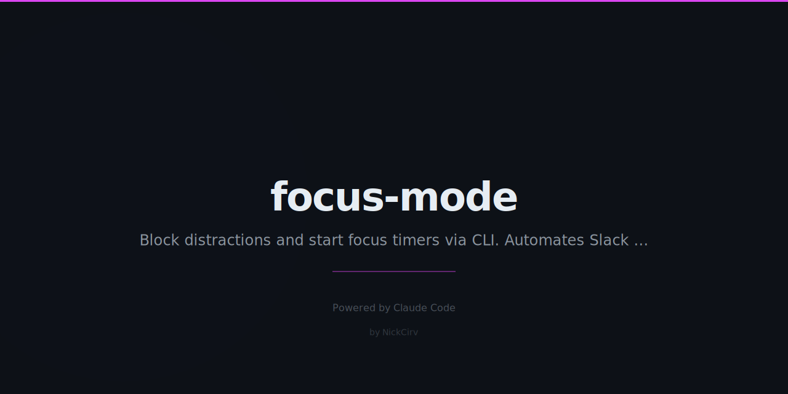

# focus-mode 🎯

One command. Deep work activated.

```bash
focus start --duration 90 --task "fix the auth bug"
```

*Slack: killed*  
*GitHub status: set*  
*Reddit: blocked*  
*Timer: started*

*Go.*

---

## Install

```bash
npm install -g focus-mode
```

Or run directly:

```bash
git clone https://github.com/NickCirv/focus-mode
cd focus-mode
npm link
```

## Usage

```bash
focus start                                    # 90 min session
focus start --duration 60                     # 60 min session
focus start --duration 90 --task "auth bug"   # with task name
focus end                                      # end early, restore everything
focus status                                   # check current session
focus config                                   # interactive setup (GitHub token, etc.)
```

## What It Does

When you run `focus start`:

1. **Kills distracting apps** — Slack, Discord, Messages (macOS/Linux)
2. **Sets GitHub status** — 🎯 "In focus mode — back in 90min" with limited availability
3. **Blocks distracting sites** — twitter.com, reddit.com, youtube.com via `/etc/hosts`
4. **Starts Pomodoro timer** — live countdown, break reminders every 25min, visual progress

When the session ends:
1. GitHub status is cleared
2. `/etc/hosts` is restored
3. Session summary with time focused
4. Honest assessment of how you did

## Config

Run `focus config` to set:

- **GitHub token** — create at [github.com/settings/tokens](https://github.com/settings/tokens) with `user` scope
- **Default duration** — in minutes (default: 90)
- **Apps to kill** — comma-separated app names
- **Sites to block** — comma-separated domains

Config stored in `~/.focus-mode.json`.

## Site Blocking

Site blocking requires write access to `/etc/hosts`. On most systems this needs sudo:

```bash
sudo focus start --duration 90 --task "deep work"
```

If you run without sudo, everything else still works — the site blocking step is skipped gracefully.

## Platform Support

| Feature | macOS | Linux | Windows |
|---------|-------|-------|---------|
| Kill apps | ✓ | ✓ | ✓ |
| GitHub status | ✓ | ✓ | ✓ |
| Block sites | ✓ | ✓ | — |
| Pomodoro timer | ✓ | ✓ | ✓ |

## Requirements

- Node.js 18+
- No dependencies — pure Node.js stdlib
